# Fleet Fury

Fleet Fury is a python terminal based Battleships game which runs in the Code Institute mock terminal on Heroku.

 The user will be paired up against the computer and try to beat it by sinking all of the computer's ships before the computer sinks theirs. Each battleship occupies one square on the grid while the amount of ships is decided by the user.

 [View the Fleet Fury project here](https://fleet-fury-f6bd1fd3ac6c.herokuapp.com)

 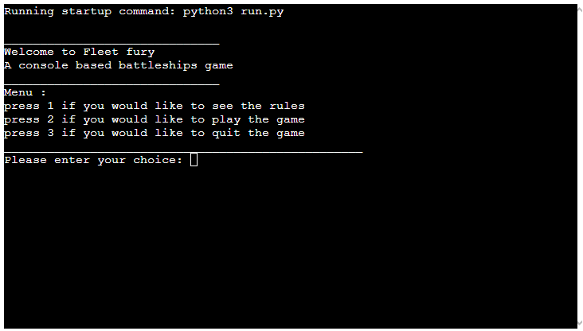

## How to play

 Fleet Fury is based on the classic tabletop game Battleships.

 In this version, the player enters their name and the amount of ships they would like to play with. 

 The position of the ships for both the player and the computer are randomly generated.

 The location of the ships are indicated by an @ sign, the location of the computer's ships are hidden and must be revealed by "shooting" at a location.

 The player enters the location that they would like to shoot by entering a number from 0 to 35.

 If the player hits a ship it is indicated by an X. if the player misses their shot it is indicated by a /.

 The player and computer take turns shooting untill one or the other has no more ships left. The participant who sinks all of their oponant's ships wins the game.

## Logic flowchart

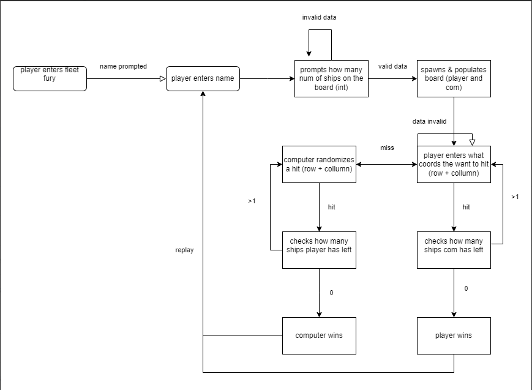

## User Experience (UX)

This website is meant to attract people who are interested in playing a game of Battleships.

The game is structured in such a way that playing it for the first time should be seamless.

### User Stories

#### First-time visitor goals
<ul>
			<li>Understand how the game works. Clear objectives and instructions.</li>
			<li>To play the game once the rules are read.</li>
			<li>To enjoy the game/</li>
</ul>

#### Returning visitor goals
<ul>		
			<li>To enjoy the game and play it more than once.</li>
			<li>To share the game with friends and family.</li>
			<li>To explore new features if they are implemented.</li>
</ul>

#### frequent user Goals
<ul>		
			<li>To share the game with friends and family.</li>
			<li>To explore new features if they are implemented.</li>
</ul>

 # features
<ul>   
	<li>Menu selection. 3 options are presented: rules, play, quit</li>
	<li>Rules section. Prints out the rules of the game</li>
	<li>Visual interface. A grid that shows the location of shots, misses and hits</li>
    <li>Input validation for: Name, number of ships,rules and guesses</li>
    <li>Win loss detection. Detecs when the player or computer succesfully sunk all enemy ships</li>
	<li>Play again at the end of the game</li>
</ul>

 ## existing features
 <ul>   
	<li>Intro screen</li>
	<li>Displays welcome message</li>	
</ul>

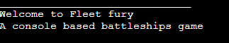
  
<ul>
		<li>Menu</li>
        <li>Displays rules
 </ul>

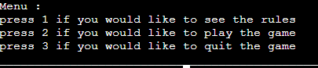

<ul>
		<li>Enter a username</li>
 </ul>

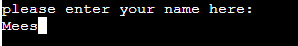

<ul>
		<li>Enter an amount of ships to play with</li>
 </ul>

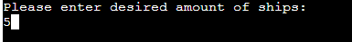

<ul>
		<li>grid for the computer</li>
        <li>Hides ship location</li>
 </ul>

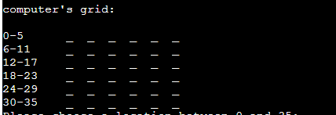

<ul>
		<li>grid for the player</li>
        <li>ships are marked with an @</li>
        <li>hits are marked with an X</li>
        <li>misses are marked with an /</li>
        <li>unknown locations are marked with an _</li>
 </ul>

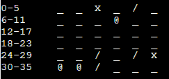

<ul>
		<li>prompts the user for a shooting location</li>
        <li>location must be an integer between 1 and 35</li>
 </ul>

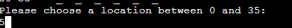

<ul>
		<li>computer sank all enemy ships</li>
        <li>message that confirms user has lost</li>
 </ul>

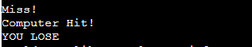

<ul>
		<li>user sank all enemy ships</li>
        <li>message that confirms user has won</li>
 </ul>

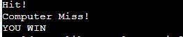

<ul>
		<li>play again</li>
 </ul>

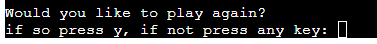

### Features Left to Implement
<ul>
	<li>Option for a second player.</li>
	<li>Scoring system.</li>
	<li>Option to choose ship locations</li>
    <li>Special powerups that clear multiple locations or give intell</li>
</ul>	

## Design

### Flowchart

<ul>
<li>draw.io</li>
</ul>

## Technologies used

<ul>
<li>Python</li>
</ul>

## Frameworks, libraries & programs used
<ul>
	<li>gitpod</li>
	to write the code
    <li>random</li>
    library to generate random ints
	<li>git</li>
    for version controll
	<li>Heroku</li>
	for deployment
    <li>CI Python Linter</li>
    To check for any code errors
</ul>

## Testing

CI Python Linter was used to test run.py

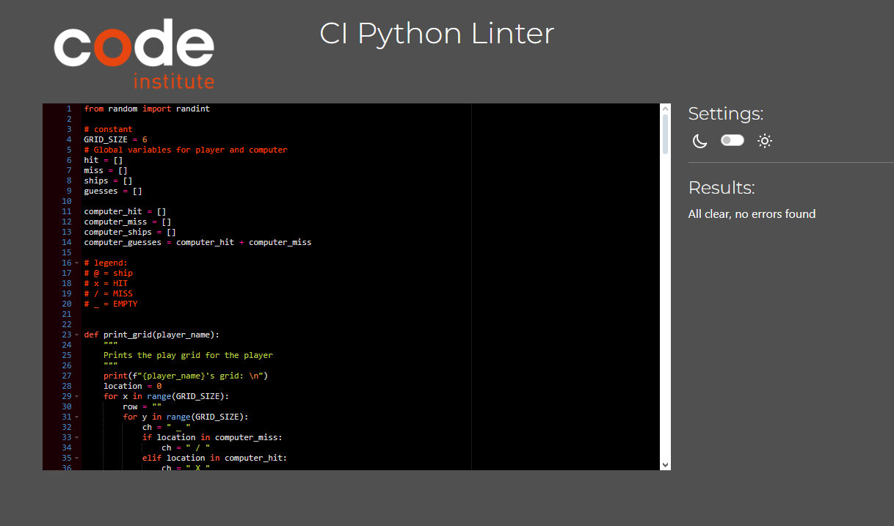

