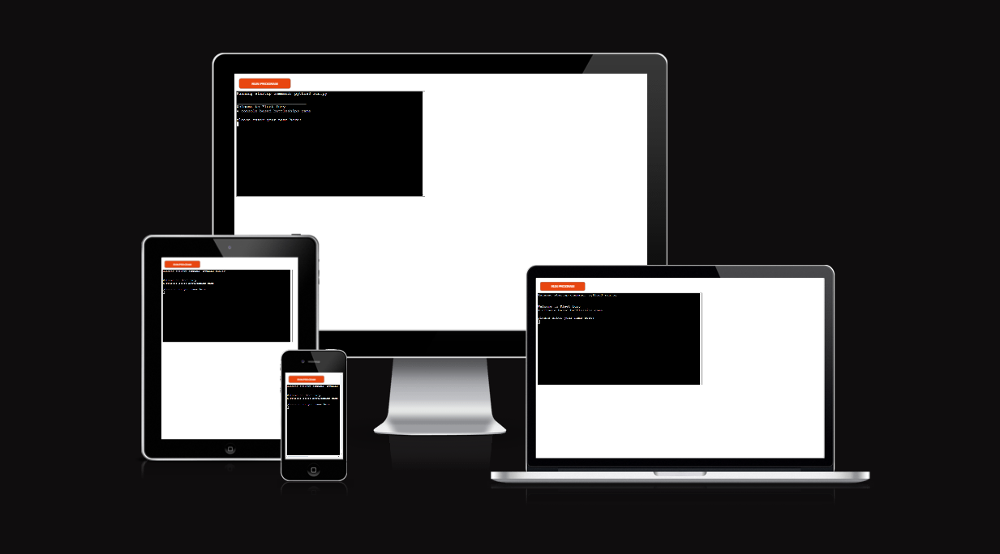

# Fleet Fury

Fleet Fury is a python terminal based Battleships game which runs in the Code Institute mock terminal on Heroku.

 The user will be paired up against the computer and try to beat it by sinking all of the computer's ships before the computer sinks theirs. Each battleship occupies one square on the grid while the amount of ships is decided by the user.

 [View the Fleet Fury project here](https://fleet-fury-f6bd1fd3ac6c.herokuapp.com)

 