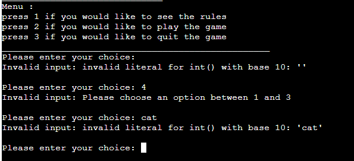
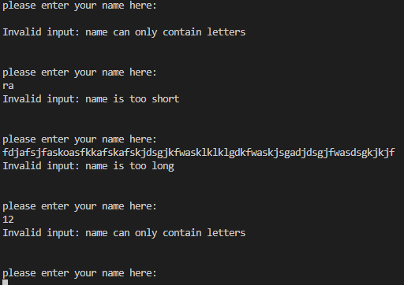
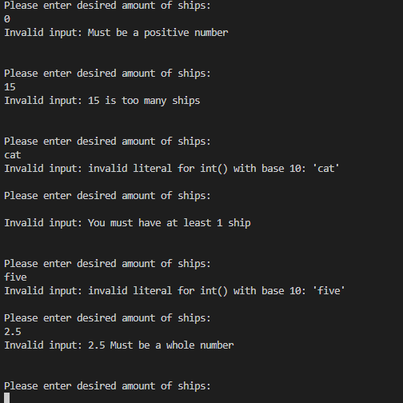
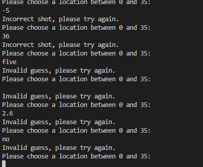

# Fleet Fury

Fleet Fury is a python terminal based Battleships game which runs in the Code Institute mock terminal on Heroku.

 The user will be paired up against the computer and try to beat it by sinking all of the computer's ships before the computer sinks theirs. Each battleship occupies one square on the grid while the amount of ships is decided by the user.

 [View the Fleet Fury project here](https://fleet-fury-f6bd1fd3ac6c.herokuapp.com)

 

## How to play

 Fleet Fury is based on the classic tabletop game Battleships.

 In this version, the player enters their name and the amount of ships they would like to play with. 

 The position of the ships for both the player and the computer are randomly generated.

 The location of the ships are indicated by an @ sign, the location of the computer's ships are hidden and must be revealed by "shooting" at a location.

 The player enters the location that they would like to shoot by entering a number from 0 to 35.

 If the player hits a ship it is indicated by an X. if the player misses their shot it is indicated by a /.

 The player and computer take turns shooting untill one or the other has no more ships left. The participant who sinks all of their oponant's ships wins the game.

## Logic flowchart

## User Experience (UX)

This website is meant to attract people who are interested in playing a game of Battleships.

The game is structured in such a way that playing it for the first time should be seamless.

### User Stories

#### First-time visitor goals
<ul>
			<li>Understand how the game works. Clear objectives and instructions.</li>
			<li>To play the game once the rules are read.</li>
			<li>To enjoy the game/</li>
</ul>

#### Returning visitor goals
<ul>		
			<li>To enjoy the game and play it more than once.</li>
			<li>To share the game with friends and family.</li>
			<li>To explore new features if they are implemented.</li>
</ul>

#### frequent user Goals
<ul>		
			<li>To share the game with friends and family.</li>
			<li>To explore new features if they are implemented.</li>
</ul>

 # features
<ul>   
	<li>Menu selection. 3 options are presented: rules, play, quit</li>
	<li>Rules section. Prints out the rules of the game</li>
	<li>Visual interface. A grid that shows the location of shots, misses and hits</li>
    <li>Input validation for: Name, number of ships,rules and guesses</li>
    <li>Win loss detection. Detecs when the player or computer succesfully sunk all enemy ships</li>
	<li>Play again at the end of the game</li>
</ul>

 ## existing features
 <ul>   
	<li>Intro screen</li>
	<li>Displays welcome message</li>	
</ul>

  
<ul>
		<li>Menu</li>
        <li>Displays rules
 </ul>

<ul>
		<li>Enter a username</li>
 </ul>

<ul>
		<li>Enter an amount of ships to play with</li>
 </ul>

<ul>
		<li>grid for the computer</li>
        <li>Hides ship location</li>
 </ul>

<ul>
		<li>grid for the player</li>
        <li>ships are marked with an @</li>
        <li>hits are marked with an X</li>
        <li>misses are marked with an /</li>
        <li>unknown locations are marked with an _</li>
 </ul>

<ul>
		<li>prompts the user for a shooting location</li>
        <li>location must be an integer between 1 and 35</li>
 </ul>

<ul>
		<li>computer sank all enemy ships</li>
        <li>message that confirms user has lost</li>
 </ul>

<ul>
		<li>user sank all enemy ships</li>
        <li>message that confirms user has won</li>
 </ul>

<ul>
		<li>play again</li>
 </ul>

### Features Left to Implement
<ul>
	<li>Option for a second player.</li>
	<li>Scoring system.</li>
	<li>Option to choose ship locations</li>
    <li>Special powerups that clear multiple locations or give intell</li>
</ul>	

## Design

### Flowchart

<ul>
<li>draw.io</li>
</ul>

## Technologies used

<ul>
<li>Python</li>
</ul>

## Frameworks, libraries & programs used
<ul>
	<li>gitpod</li>
	to write the code
    <li>random</li>
    library to generate random ints
	<li>git</li>
    for version controll
	<li>Heroku</li>
	for deployment
    <li>CI Python Linter</li>
    To check for any code errors
</ul>

## Testing

CI Python Linter was used to test run.py

### manual testing

This game was manually tested using the gitpod terminal. 
After deployment to Heroku it was manually tested again use the Heroku terminal.
Testing was done on the display, Name input validation, ship amount input validation, shot input validation, grid display and play again feature.

| feature   | expected result | steps taken | actual result |
| --------- | --------------- | ----------- | ------------- |
| intro screen | To display welcome message and menu  | none | as expected
| display rules | To display the rules | input "1" to display | as expected
| start game | To start the game by prompting user name| input "2" to start the game | as expected
| quit     | To quit the game if player chooses so | input "3" to quit the game | as expected
| enter name | To save username and use it in messages | input an alphanumerical username between 3 and 15 letters | as expected
| enter ship amount | To enter a valid amount of ships to play with | input a integer ship amount between 1 and 10 | as expected
| enter shot location | To enter a valid shot location | input an integer shot location between 0 and 35 | as expected
| hit | To display an X at the shot location and update hit list | input a shot location populated by a ship| as expected
| miss | To display an / at the shot location and update miss list | input a shot location not populated by a ship | as expected
| already shot at location | To display message that location has been shot at and prompt for new shot | input a location already shot at | as expected
| win | To display win message and prompt to play again | sink all enemy player's ships | as expected
| lose | To display lose message and prompt to play again | sink all player's ships | as expected
| play again | To restart the game and clear all relevent variables | enter y to restart the game, anything else to quit | as expected

## Input validation testing

<ul>
<li>Menu</li>
<li>cannot leave blank</li>
<li>cannot be 0 or higher than 3</li>
<li>cannot be a string</li>
<li>cannot be a decimal</li>
<li>must be an integer between 0 and 3</li>
</ul>

<ul>
<li>Name prompt</li>
<li>cannot leave blank</li>
<li>cannot be smaller than 3 or larger than 15 letters/<li>
<li>cannot be an integer</li>
<li>cannot be a decimal</li>
<li>must be an a string between 3 or 15 letters</li>
</ul>

<ul>
<li>Ship prompt</li>
<li>cannot leave blank</li>
<li>cannot be be less than 1 or larger than 10</li>
<li>cannot be a string</li>
<li>cannot be a decimal</li>
<li>must be an an integer between 1 and 10</li>
</ul>

<ul>
<li>Shot prompt</li>
<li>cannot leave blank</li>
<li>cannot be be less than 0 or larger than 35</li>
<li>cannot be a string</li>
<li>cannot be a decimal</li>
<li>must be an an integer between 0 and 35</li>
</ul>

## Fixed bugs

<ul>
<li>a bug where player could shoot same location</li>
<li>Fixed by correcting shot input validation</li>
<li>a bug where inputted ship amount did not generate right amount</li>
<li>Fixed by checking for ship location duplicates</li>
<li>computer hit removes computer ships</li>
<li>Fixed by removing computer_ships instead of ships</li>
<li>ship amount doubled</li>
<li>Fixed by seperately populating computer grid and player grid</li>
<li>Computer got hit with both shots</li>
<li>Fixed by seperating player and computer grid</li>
<li>Grid prints with no player input</li>
<li>Fixed by correctly checking for player input</li>
</ul>

## Deployment

Deploying to Heroku
To deploy with Heroku, Code Institute Python Essentials Template was used so the python code can be viewed in a terminal in a browser
<ol>
<li>Log in to Heroku or create a new account</li>
<li>On the main page click "New" and select "Create new app"</li>
<li>Choose your unique app name and select your region</li>
<li>Click "Create app"</li>
<li>On the next page find "settings" and locate "Config Vars"</li>
<li>Click "Reveal Config Vars" and add "PORT" key and value "8000", click "Add"</li>
<li>Scroll down, locate "Buildpack" and click "Add", select "Python"</li>
<li>Scroll to the top and select "Deploy" tab</li>
<li>Select GitHub as deployment method and search for your repository and link them together</li>
<li>Scroll down and select either "Enable Automatic Deploys" or "Manual Deploy"</li>
<li>Deployed site Fleet Fury</li>
</ol>